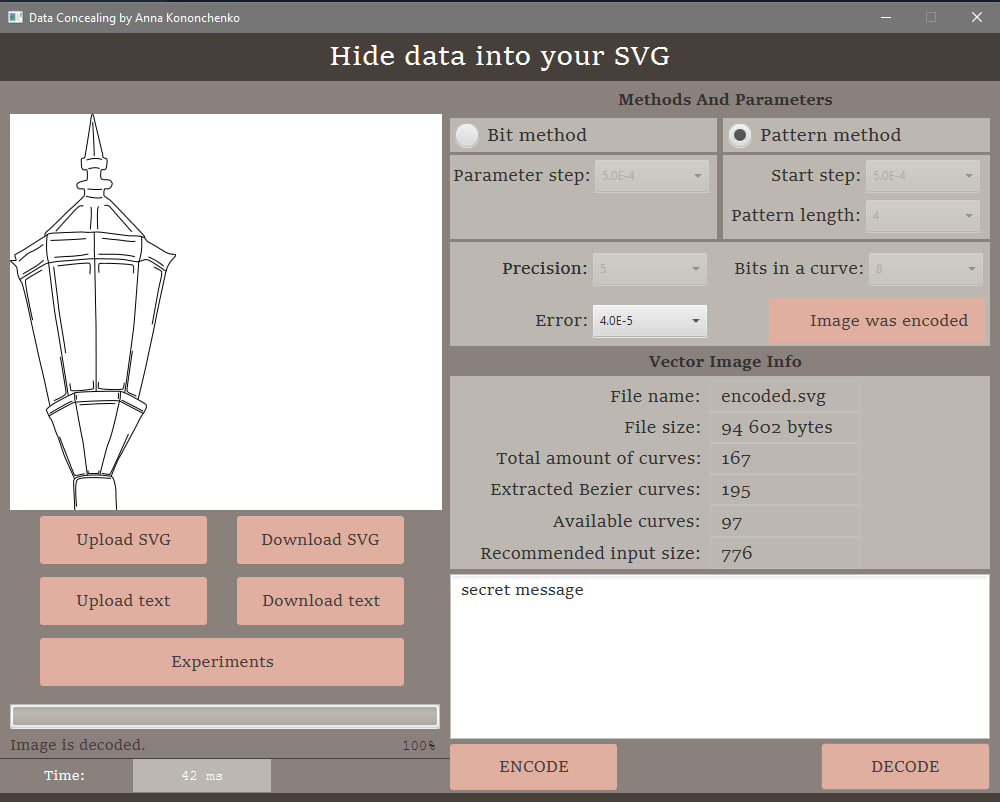
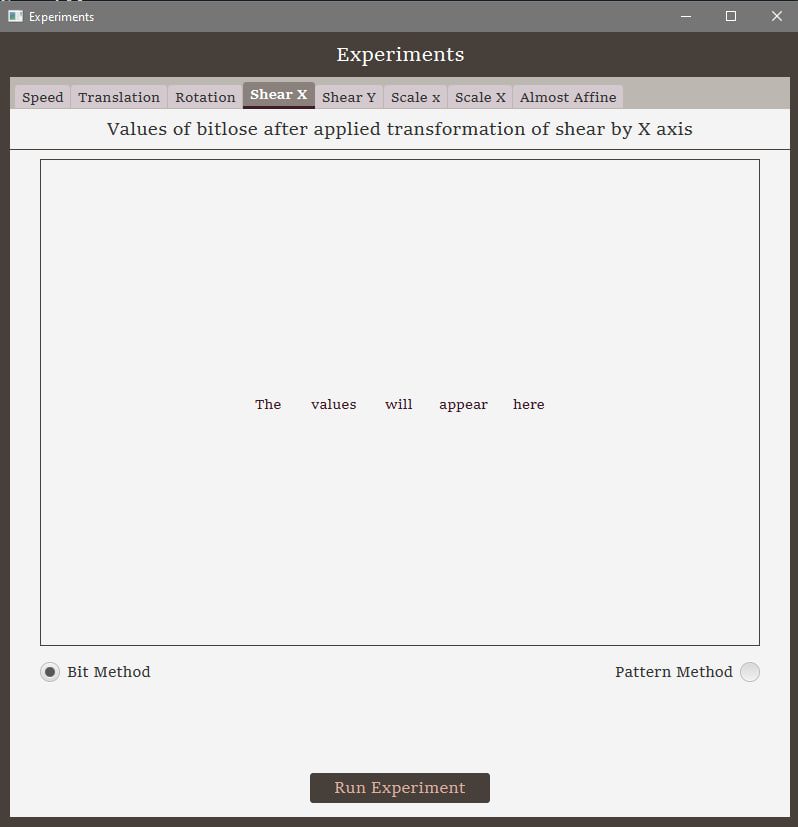
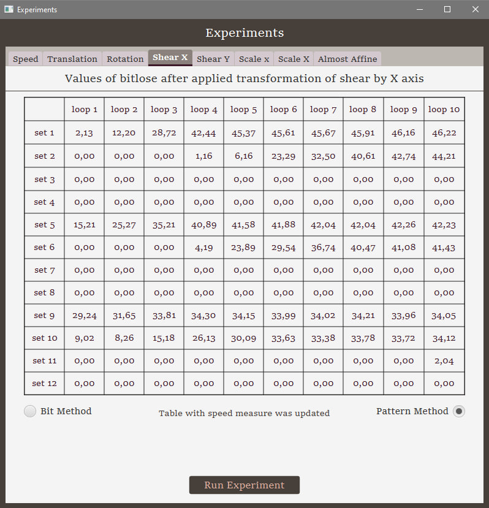
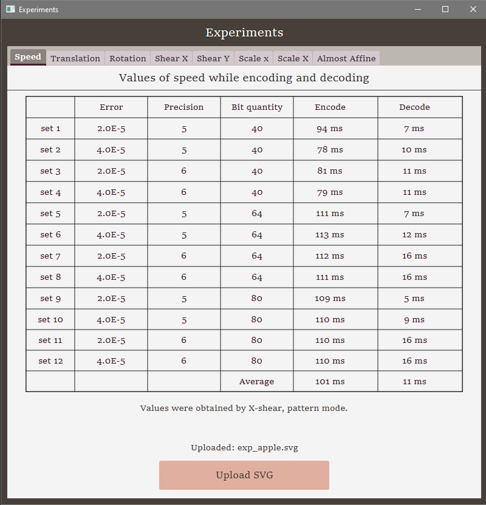

# Research about steganographic methods of data concealing into vector graphic images

This project was created for a master graduation work and is dedicated to an implementation of Kinzeryaviy's methods of data concealing in vector images.

The key points of the implemantation:
- SVG images
- Bezier curves
- De Casteljau algorithm
- Java

Problems:
- parser for handling SVG-images is not ideal
- images should be specially chosen (or created on your own)

Additional:
- examples of recommended images-containers can be found in resources\com\diploma\stegovector\svgImages folder

## APP DESCRIPTION
In this project for GUI a JavaFX library was used.  
The main window looks like following:
- image is uploaded, message goes to the according text area

- image is decoded, obtained secret message is in the according text area

The experiments window looks like following:
- initial view of the random chosen tab (before the experiment)

- a view of the random chosen tab (after the experiment)

- obtained time measures

*The point of experiments lays in getting the values of lost bits while applying different types of the affine transformations (for each set of parameters an affine transformation is applied 10 times - each time to previously changed container).*

## NOTE
For any additional information you can get acquainted with my publications [here](https://www.scopus.com/authid/detail.uri?authorId=57208665914).

    